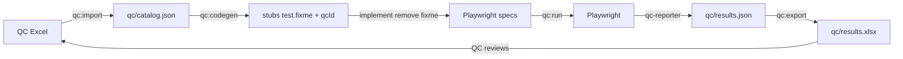

# QC Excel Bridge

> **VI:** Cách gắn Playwright với file testcase QC chuẩn ISC.  
> **EN:** How Playwright binds to the ISC QC testcase workbook.

## What the Excel already gives us

From an ISC-style `ISC_<PROJECT>_TestCase.xlsx` workbook:

| Column | Role for automation |
|--------|---------------------|
| `Testcase ID` (e.g. `TC_03.1`) | Primary key ↔ Playwright annotation `qcId` |
| `Req ID` | Traceability to BA requirements |
| `Group` | Functional / UI / Integration / Database |
| `Priority` | High (P1) / Medium / Low — filter smoke vs full |
| `Test Title` / `Pre-condition` / `Test Steps` / `Expected Result` | Spec authoring source |
| `Automated` / `Script` / `KQ Script` / `Status` | Write-back targets after a run |

Meta sheets skipped on import: Cover, Guideline, Revision History, Summary, Dashboard, Report Test, Bug Data, RTM.

## Recommended workflow (Level A → B)



1. **Import** — `npm run qc:import:py` (or `qc:import` if `xlsx` is installed):

```bash
npm run qc:import:py -- --file qc/input/ISC_*_TestCase.xlsx
```

2. **Codegen stubs (Level A)** — default P1:

```bash
npm run qc:codegen -- --priority High
# optional: --group Functional | --sheet "…" | --id TC_03.1 | --all | --dry-run
```

Writes `e2e/specs/qc/<sheet>.generated.spec.ts` (`test.fixme` + `qcId` + Pre/Steps/Expected comments).  
Skips TC ids already implemented as real `test(...)`.

3. **Implement (Level B)** — remove `.fixme`, write real steps (wave by P1 Functional first).

4. **Run filtered**

```bash
npm run qc:run -- --id TC_03.1
npm run qc:run -- --priority High --group Functional
npm run qc:run -- --priority High --headed
```

5. **Export** — `npm run qc:export` → `qc/results.xlsx` (never overwrites the QC source).

Agent skills: `/quality-qc-import` → `/quality-qc-codegen` → `/quality-qc-run`.

## What to automate first

| Priority | Suggestion |
|----------|------------|
| P1 Functional | Happy paths + hard validations (blockers) |
| P1 UI | Only if selector-stable (prefer role/label) |
| Integration needing external systems | `*.real.spec.ts` + auth.real adapter |
| Pure visual / copy | Keep manual in Excel |

`qc:codegen` only creates **stubs** (`test.fixme`). Humans/agents implement runnable steps; the bridge keeps IDs and results aligned with QC.

## Coverage report

After codegen:

```bash
cat qc/coverage.json
```

After a filtered run:

```bash
node -e "
const c=require('./qc/catalog.json');
const r=require('./qc/results.json');
const done=new Set((r.rows||[]).map(x=>x.qcId));
console.log('catalog', c.count, 'automated-ran', done.size);
"
```

## Phase 2 ideas

- Map `Req ID` ↔ KB `09-requirements/REQ-*`  
- AI-assisted step → Playwright draft (fits future `ai-review/` module)
